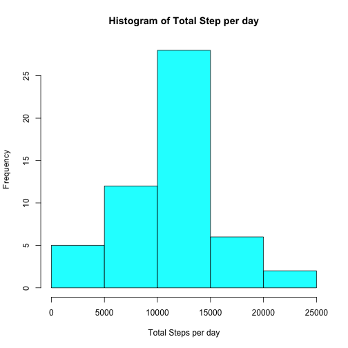
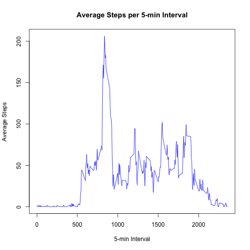
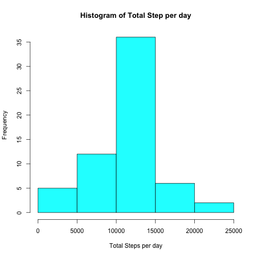
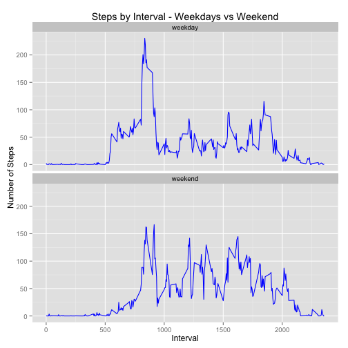

This assignment makes use of data from a personal activity monitoring device. Data is collected at 5 minute intervals throughout each day over the course of two months (Oct & Nov) in 2012.  

Dataset = [Activity Monitoring Data](https://d396qusza40orc.cloudfront.net/repdata%2Fdata%2Factivity.zip)

  
  
  
## Loading and preprocessing the data
1. First step is to read in the data.  Save as ```activity``` dataframe :

```r
## Get Zip file data from URL if it doesn't already exist.   Unzip if downloaded
fileUrl <- "https://d396qusza40orc.cloudfront.net/repdata%2Fdata%2Factivity.zip"

if(!file.exists("./repdata-data-activity.zip")) { download.file(fileUrl, destfile="./repdata-data-activity.zip", method="curl") ;  unzip("./repdata-data-activity.zip", exdir="./") }

## Read in data to activity dataframe
activity <- read.csv("./activity.csv")
```

A sample of the data :

```r
head(activity)
```

```
##   steps       date interval
## 1    NA 2012-10-01        0
## 2    NA 2012-10-01        5
## 3    NA 2012-10-01       10
## 4    NA 2012-10-01       15
## 5    NA 2012-10-01       20
## 6    NA 2012-10-01       25
```

```r
tail(activity)
```

```
##       steps       date interval
## 17563    NA 2012-11-30     2330
## 17564    NA 2012-11-30     2335
## 17565    NA 2012-11-30     2340
## 17566    NA 2012-11-30     2345
## 17567    NA 2012-11-30     2350
## 17568    NA 2012-11-30     2355
```

2. Transform the data into a summary of steps taken per day  (using the dplyr library to group_by date and summarize total # of steps take each date).   Missing values (NA's) are ignored.


```r
suppressMessages(library(dplyr))  ## load dplyr library for group_by and summarize functions

## created new dataframe that is total number of steps taken per day
activity_df <- group_by(activity, date) %>% 
        summarize(totalsteps = sum(steps))
```
A sample of the data :

```r
head(activity_df)
```

```
## Source: local data frame [6 x 2]
## 
##         date totalsteps
## 1 2012-10-01         NA
## 2 2012-10-02        126
## 3 2012-10-03      11352
## 4 2012-10-04      12116
## 5 2012-10-05      13294
## 6 2012-10-06      15420
```

```r
tail(activity_df)
```

```
## Source: local data frame [6 x 2]
## 
##         date totalsteps
## 1 2012-11-25      11834
## 2 2012-11-26      11162
## 3 2012-11-27      13646
## 4 2012-11-28      10183
## 5 2012-11-29       7047
## 6 2012-11-30         NA
```

## What is mean total number of steps taken per day?

1. Histogram of total number of steps taken each day


```r
hist(activity_df$totalsteps, col=5, main="Histogram of Total Step per day", xlab="Total Steps per day")
```

 
  
2. Calulating the **mean** and **median** total number of steps taken per day  
  
The mean =  

```r
mean(activity_df$totalsteps, na.rm=TRUE) ## Calculate mean on total steps per day
```

```
## [1] 10766.19
```

The median = 

```r
median(activity_df$totalsteps, na.rm=TRUE) ## Calculate median on total steps per day
```

```
## [1] 10765
```


## What is the average daily activity pattern?
1. Below is a time series plot (i.e ``` type="l"```) of the 5-minute interval (x-axis) and the average number of steps taken, averaged across all days (y-axis)


```r
## group data by interval and find mean of that interval across all days
avg_pattern <- group_by(activity, interval) %>% 
        summarize(mean = mean(steps, na.rm=TRUE))

## plot the average steps across the 5-min intervals
plot(avg_pattern$interval, avg_pattern$mean, type="l", main="Average Steps per 5-min Interval", xlab="5-min Interval", ylab="Average Steps",col="blue")
```

 


2. The interval that contains the maximum number of steps =

```r
avg_pattern$interval[which.max(avg_pattern$mean)]  ## 5 minute interval that contains the max steps
```

```
## [1] 835
```
  
The max value =

```r
max(avg_pattern$mean)
```

```
## [1] 206.1698
```

## Imputing missing values
1. There are some missing values for some intervals.  The total number of missing values in the dataset (i.e the total number of rows with NA's) can be calculated as below:

```r
length(which(is.na(activity$steps)))  ## number of rows with NA's for num steps
```

```
## [1] 2304
```

2. To fill in these missing values, I chose to take the mean value of that same 5-min interval across other days.  This code finds the rows that have NA's in the ```steps``` column.

```r
ind <- which(is.na(activity$steps), arr.ind=TRUE)  ## find rows that have NA's for steps
```
  
3. Now we create a new dataset to fill in the missing values with the mean for that interval. Using the missing values rows as an Index, we match the interval of new dataset to the interval of the earlier computed mean by 5-min intervals ```avg_pattern``` above.

```r
activity_full <- activity  ## copy activity dataframe

## match interval of activity and summarized by interval dataframes - store mean value
results <- avg_pattern[match(activity_full$interval,avg_pattern$interval),"mean"]

## use index of NA values from step2 above to set corresponding mean value for the interval
activity_full$steps[ind] <- results$mean[ind]
```

4. Below is the Histogram of the total number of steps taken each day:  

```r
## Summarize the new full dataframe with total number of steps each day.
activity_full_df <- group_by(activity_full, date) %>% 
        summarize(totalsteps = sum(steps))

## historgram of total number of steps each day, with no missing values
hist(activity_full_df$totalsteps, col=5, main="Histogram of Total Step per day", xlab="Total Steps per day")
```

 
  
The Calculated mean of the fully populated data =

```r
mean(activity_full_df$totalsteps)
```

```
## [1] 10766.19
```
  
The Calculated median of the fully populated data = 

```r
median(activity_full_df$totalsteps)
```

```
## [1] 10766.19
```
  
Overall the impact of imputing missing data did not have much impact on the Mean and Median since a mean value of a given interval was used.   Its possible that using another method could have had more effect on the mean/median.

 
  
## Are there differences in activity patterns between weekdays and weekends?

1. A new factor varaible ```daytype``` with levels ```weekday``` and ```weekend``` was created and input into the dataset.   Saturday and Sunday were assumed to be weekend.  All other days were weekday.


```r
activity_full$date <- as.Date(activity_full$date, "%Y-%m-%d")  ## convert column date to Date format

## if the weekday = Saturday or Sunday set daytype to weekend otherwise set to weekday
activity_full$daytype <- ifelse(weekdays(activity_full$date) == "Saturday", "weekend", ifelse(weekdays(activity_full$date) == "Sunday", "weekend", "weekday"))

## Convert the column daytype to a factor with 2 levels - weekend and weekday
activity_full$daytype <- as.factor(activity_full$daytype)  ## convert to factor with levels weekday, weekend
```
2.  See below for A panel plot containing a time series plot (i.e ```type = "l" ```) of the 5-minute interval (x-axis) and the average number of steps taken, averaged across all weekday days or weekend days(y-axis).

```r
avg_pattern_full <- group_by(activity_full, daytype, interval) %>% 
        summarize(steps = mean(steps))

library(ggplot2)  ## load ggplot2 library for plotting

## Use ggplot to plot average data.  
## facet_wrap uses the type daytype to create 2 charts - weekday and weekend
plotobj <- ggplot(avg_pattern_full, aes(x = interval, y = steps))
plotobj <- plotobj + labs(title="Steps by Interval - Weekdays vs Weekend")
plotobj <- plotobj + labs(y="Number of Steps", x="Interval")
plotobj <- plotobj + geom_line(color="blue") + facet_wrap (~ daytype, ncol=1)
print(plotobj)
```

 


